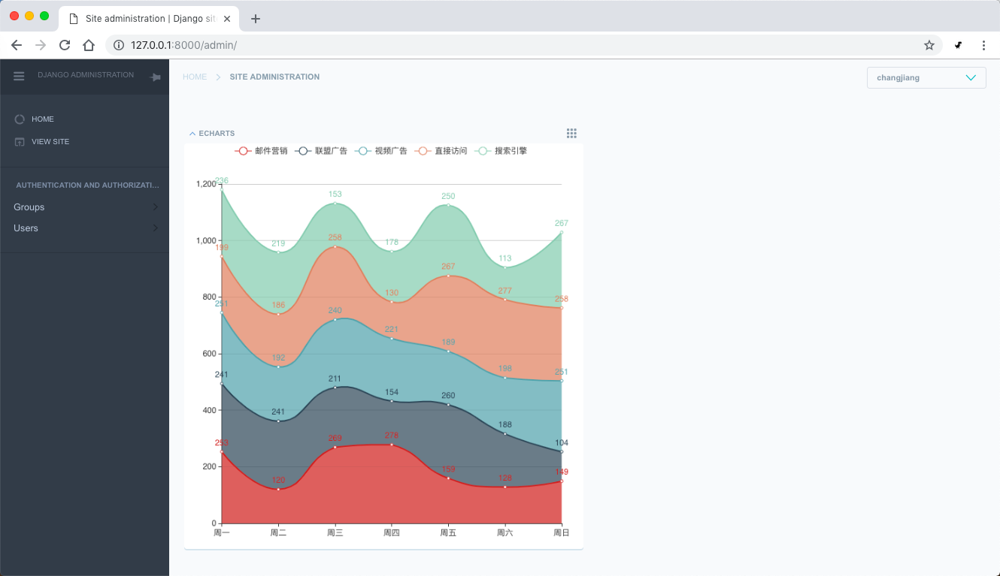

# 简化版django-jet

## 更新日志
- 2018-09-29 删除所有对jet model的依赖，新增echarts模块

## 运行起来
- 克隆代码
- 直接运行 python manage.py runserver 

## 和原版django-jet的区别

- 不自带任何model
- 根目录的urls.py无需做任何处理

这是简化版的
```python
from django.contrib import admin
from django.urls import path,include

urlpatterns = [
    path('admin/', admin.site.urls),
]
```

这是原版的
```python
from django.contrib import admin
from django.urls import path,include

urlpatterns = [
    path('jet/', include('jet.urls', 'jet')),  # Django JET URLS
    path('jet/dashboard/', include('jet.dashboard.urls', 'jet-dashboard')),
    path('admin/', admin.site.urls),
]
```

- 新增对echarts的支持
