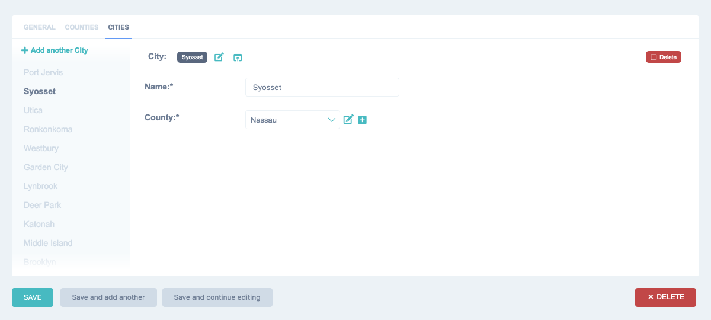

==============
Compact Inline
==============

By default Django admin interface provides two types of inlines to edit models on the same page as a
related model – ``StackedInline`` and ``TabularInline``. ``StackedInline`` is mostly used when there are
not so many objects. If number of models is rather big, ``TabularInline`` can help you. Unfortunately when
related model has a lot of fields it may be not convenient to interact with them.
To solve this problem JET has a ``CompactInline`` class built-in.

Usage
-----

``CompactInline`` works exactly like Django built-in inlines, you need just
to inherit ``jet.admin.CompactInline`` inline class. That's all.

.. code:: python

    from django.contrib import admin
    from people.models import County, State, City
    from jet.admin import CompactInline

    class StateCountiesInline(admin.TabularInline):
        model = County
        extra = 1
        show_change_link = True

    class StateCitiesInline(CompactInline):
        model = City
        extra = 1
        show_change_link = True

    class StateAdmin(admin.ModelAdmin):
        inlines = (StateCountiesInline, StateCitiesInline)
