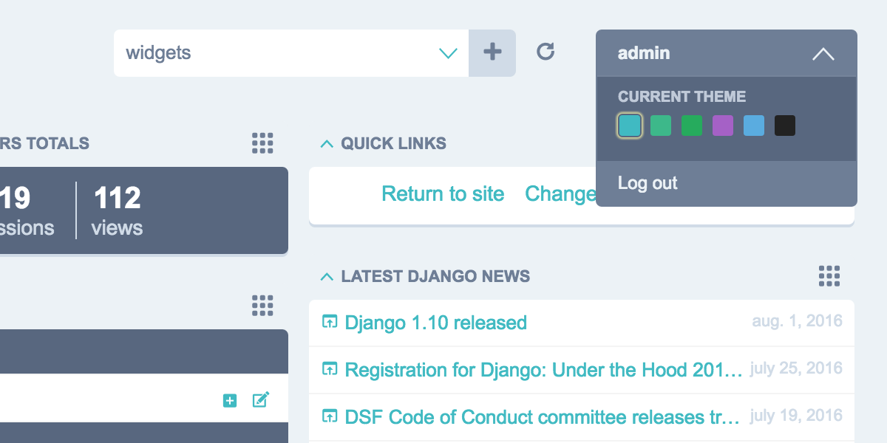
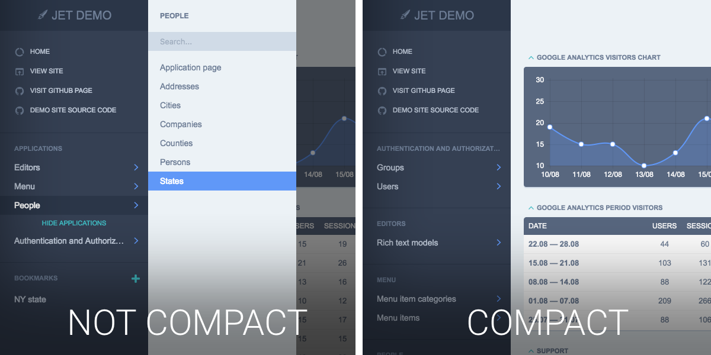
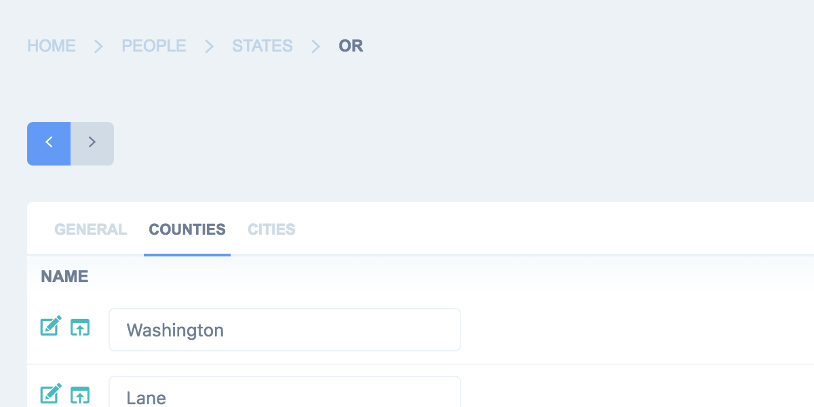

Config file
===========

Options available in settings.py:

JET_DEFAULT_THEME
-----------------

Django JET allows you to change default theme. This feature is mainly used for customizing color schemes rather than
making absolutely different themes. This option in fact make Django load different css styles.

Possible built-in themes are:

* default
* green
* light-violet
* light-green
* light-blue
* light-gray

To change theme use parameter:

.. code:: python

    JET_DEFAULT_THEME = 'light-gray'

JET_THEMES
----------

You can allow your users to change admin panel color scheme. This option will add color scheme chooser to the user dropdown menu. Make ``JET_THEMES`` an empty list to disable this feature.

.. code:: python

    JET_THEMES = [
        {
            'theme': 'default', # theme folder name
            'color': '#47bac1', # color of the theme's button in user menu
            'title': 'Default' # theme title
        },
        {
            'theme': 'green',
            'color': '#44b78b',
            'title': 'Green'
        },
        {
            'theme': 'light-green',
            'color': '#2faa60',
            'title': 'Light Green'
        },
        {
            'theme': 'light-violet',
            'color': '#a464c4',
            'title': 'Light Violet'
        },
        {
            'theme': 'light-blue',
            'color': '#5EADDE',
            'title': 'Light Blue'
        },
        {
            'theme': 'light-gray',
            'color': '#222',
            'title': 'Light Gray'
        }
    ]

CUSTOM JET_THEME
----------------

You are free to add your own color schemes by adding new folder to **/static/jet/css/themes/**.
You can use **/jet/static/jet/css/themes/light-violet/** folder as an example (available in Django JET repository).
_variables.scss contains **all** customizable variables. You'll have to compile all .scss files in theme directory
to start using your own theme.

COMPACT MENU
------------

If you don't have a lot of apps and models it can be annoying to have a two-level menu.
In this case you can use menu's compact mode, which will list applications and models in the side menu without need
to move pointer over applications to show models.

.. code:: python

    JET_SIDE_MENU_COMPACT = True

Default is ``False``

CUSTOM MENU
-----------

By default JET displays all applications and it models in the side menu in the alphabetical order.
To display applications and models you want or to change their order you can use ``JET_SIDE_MENU_ITEMS`` setting.

.. code:: python

    JET_SIDE_MENU_ITEMS = [  # A list of application or custom item dicts
        {'label': _('General'), 'app_label': 'core', 'items': [
            {'name': 'help.question'},
            {'name': 'pages.page', 'label': _('Static page')},
            {'name': 'city'},
            {'name': 'validationcode'},
            {'label': _('Analytics'), 'url': 'http://example.com', 'url_blank': True},
        ]},
        {'label': _('Users'), 'items': [
            {'name': 'core.user'},
            {'name': 'auth.group'},
            {'name': 'core.userprofile', 'permissions': ['core.user']},
        ]},
        {'app_label': 'banners', 'items': [
            {'name': 'banner'},
            {'name': 'bannertype'},
        ]},
    ]

JET_SIDE_MENU_ITEMS is a list of application or custom item dicts. Each item can have the following keys:

* `app_label` - application name
* `label` - application text label
* `items` - list of children items
* `url` - custom url (format is described below)
* `url_blank` - open url in new table (boolean)
* `permissions` - list of required permissions to display item

Setting `items` and either `app_label` or `label` is required. Other keys are optional to override default behavior.
Order of items is respected. Each menu item is also a dict with the following keys:

* `name` - model name (can be either `MODEL_NAME` or `APP_LABEL.MODEL_NAME`)
* `label` - item text label
* `url` - custom url (format is described below)
* `url_blank` - open url in new table (boolean)
* `permissions` - list of required permissions to display item

Setting either `name` or `label` is required. Other keys are optional to override default behavior.
Order of items is respected.

URLs can be either `string` or `dict`. Examples of possible values:

* http://example.com/
* {'type': 'app', 'app_label': 'pages'}
* {'type': 'model', 'app_label': 'pages', 'model': 'page'}
* {'type': 'reverse', 'name': 'pages:list', 'args': [1], 'kwargs': {'category': 2}}

.. deprecated:: 1.0.6

    Old way of customizing menu items via `JET_SIDE_MENU_CUSTOM_APPS` setting is now deprecated in favor
    of new `JET_SIDE_MENU_ITEMS` setting.

    .. code:: python

        JET_SIDE_MENU_CUSTOM_APPS = [
            ('core', [ # Each list element is a tuple with application name (app_label) and list of models
                'User',
                'MenuItem',
                'Block',
            ]),
            ('shops', [
                'Shop',
                'City',
                'MetroStation',
            ]),
            ('feedback', [
                'Feedback',
            ]),
        ]

If have multiple admin sites and you want to specify different menu applications for each admin site, wrap menu lists
in dictionary with admin site names as keys:

.. code:: python

    JET_SIDE_MENU_ITEMS = {
        'admin': [
            {'label': _('General'), 'app_label': 'core', 'items': [
                {'name': 'help.question'},
                {'name': 'pages.page'},
                {'name': 'city'},
                {'name': 'validationcode'},
            ]},
            ...
        ],
        'custom_admin': [
            {'app_label': 'talks', 'items': [
                {'name': 'talk'},
                {'name': 'talkmessage'},
            ]},
            ...
        ]
    }

.. note::

    You can use ``jet_side_menu_items_example`` management command to generate example ``JET_SIDE_MENU_ITEMS``
    setting which includes all your applications and models. You can use it this way:

    .. code:: python

        python manage.py jet_side_menu_items_example

JET_CHANGE_FORM_SIBLING_LINKS
-----------------------------

Adds buttons to change forms that allows you to navigate to previous/next object without returning back to change list.
Can be disabled if hit performance.

.. code:: python

    JET_CHANGE_FORM_SIBLING_LINKS = True

Default is ``True``

JET_INDEX_DASHBOARD
-------------------

Sets which dashboard class will be used for rendering admin index dashboard. Allows you to create
your own dashboard with custom modules and pre-installed layout.

.. code:: python

    JET_INDEX_DASHBOARD = 'jet.dashboard.dashboard.DefaultIndexDashboard'

JET_APP_INDEX_DASHBOARD
-----------------------

Same as **JET_INDEX_DASHBOARD**, but for application pages

.. code:: python

    JET_APP_INDEX_DASHBOARD = 'jet.dashboard.dashboard.DefaultAppIndexDashboard'

