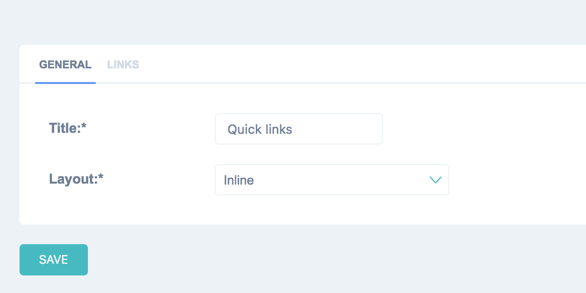

=======================
Custom Dashboard Module
=======================

In order create your own dashboard module you need to follow these steps:

* Inherit :ref:`Dashboard Module <Dashboard Module>`
* Create module template
* *(optional) Add module views*

Also you can always see build-in modules as examples in ``jet/dashboard/modules.py`` file and
``jet/dashboard/dashboard_modules/`` directory on the repository.

Inherit Dashboard Module
------------------------

* Create dashboard modules file ``dashboard_modules.py`` (or any other you prefer) inside your Django application
* Create dashboard module class inherited from base :ref:`dashboard module <Dashboard Module>` class and add it to
  ``dashboard_modules.py`` file. You can see list of all available module attributes :ref:`here <Dashboard Module>`.
  ``init_with_context`` method allows you to load data and initialize module's state. You can store data in
  module's fields as this instance will be passed to template.

Example of ``dashboard_modules.py``:

    .. code-block:: python

        from jet.dashboard.modules import DashboardModule
        from contact.models import Ticket

        class RecentTickets(DashboardModule):
            title = 'Recent tickets'
            title_url = Ticket.get_admin_changelist_url()
            template = 'contact/dashboard_modules/recent_tickets.html'
            limit = 10

            def init_with_context(self, context):
                self.children = Ticket.objects.order_by('-date_add')[:self.limit]

* Optionally you can add customizable module settings and content which will be seen in administration interface.
  For customizable settings ``settings_form`` should be set, also ``settings_dict`` and ``load_settings`` methods
  should be implemented. For customizable content items ``child_form``, ``child_name`` and ``child_name_plural``
  should be set, also ``store_children`` should return ``True``. You can validate loaded from database children
  in ``__init__`` method.

Example of ``LinkList`` dashboard module which has custom settings and editable list of links:

    .. code-block:: python

        class LinkList(DashboardModule):
            title = 'Links'
            template = 'jet.dashboard/modules/link_list.html'
            layout = 'stacked'
            children = []
            settings_form = LinkListSettingsForm
            child_form = LinkListItemForm
            child_name = 'Link'
            child_name_plural = 'Links'

            def __init__(self, title=None, children=list(), **kwargs):
                children = list(map(self.parse_link, children))
                kwargs.update({'children': children})
                super(LinkList, self).__init__(title, **kwargs)

            def settings_dict(self):
                return {
                    'layout': self.layout
                }

            def load_settings(self, settings):
                self.layout = settings.get('layout', self.layout)

            def store_children(self):
                return True

            def parse_link(self, link):
                if isinstance(link, (tuple, list)):
                    link_dict = {'title': link[0], 'url': link[1]}
                    if len(link) >= 3:
                        link_dict['external'] = link[2]
                    return link_dict
                elif isinstance(link, (dict,)):
                    return link

        class LinkListSettingsForm(forms.Form):
            layout = forms.ChoiceField(label='Layout', choices=(('stacked', 'Stacked'), ('inline', 'Inline')))

        class LinkListItemForm(forms.Form):
            url = forms.CharField(label='URL')
            title = forms.CharField(label='Title')
            external = forms.BooleanField(label='External link', required=False)

Create Module Template
----------------------

Create template at path specified in module class. Module instance is passed to template as ``module`` variable
so you can get data directly from it.

    .. code-block:: html

        

        <ul>
            
                <li>
                    
                        
                            {{ ticket.date_add|naturalday }} 
                        
                    

                    
                        
                    
                        
                    

                    <a href="{{ ticket.get_admin_url }}">{{ ticket.name }}</a>
                </li>
            
                <li>
                    Nothing to show
                </li>
            
        </ul>

Add Module Views (Optional)
---------------------------

If your dashboard module needs to have own views you can register them the following way and store for example
in ``dashboard_modules_views.py`` file inside your application:

    .. code-block:: python

        from django.conf.urls import url
        from django.contrib import messages
        from django.shortcuts import redirect
        from jet.dashboard import dashboard
        from core.utils.utils import DatabaseManager

        def update_database(request):
            database_manager = DatabaseManager()
            database_manager.update_database()

            messages.success(request, 'Database was successfully updated')

            return redirect(request.META.get('HTTP_REFERER'))

        # This method registers view's url
        dashboard.urls.register_urls([
            url(
                r'^update_database/',
                update_database,
                name='update-database'
            ),
        ])

You should import this file before dashboard urls have been imported in you main ``urls.py`` file.

    .. code-block:: python

        from django.conf import settings
        from django.conf.urls import include, url
        from django.contrib import admin

        # Import dashboard module views
        from core import dashboard_modules_views

        urlpatterns = [
            url(r'^admin/', include(admin.site.urls)),
            url(r'^jet/', include('jet.urls', 'jet')),
            url(r'^jet/dashboard/', include('jet.dashboard.urls', 'jet-dashboard')),
            ...
        ]

After that you can reverse url to module's view this way:

    .. code-block:: html

        
