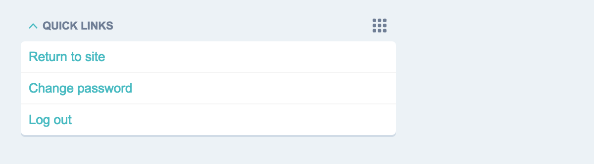
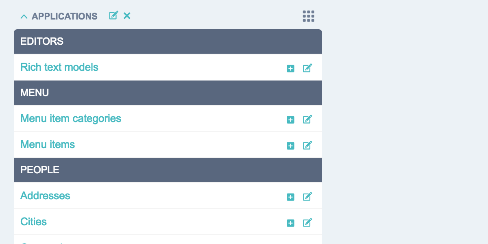
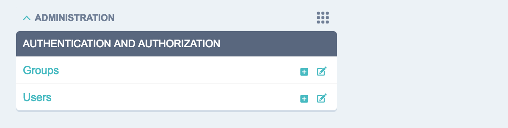
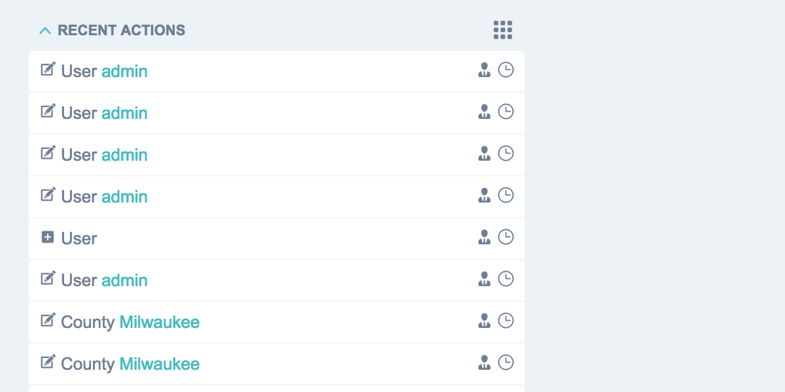
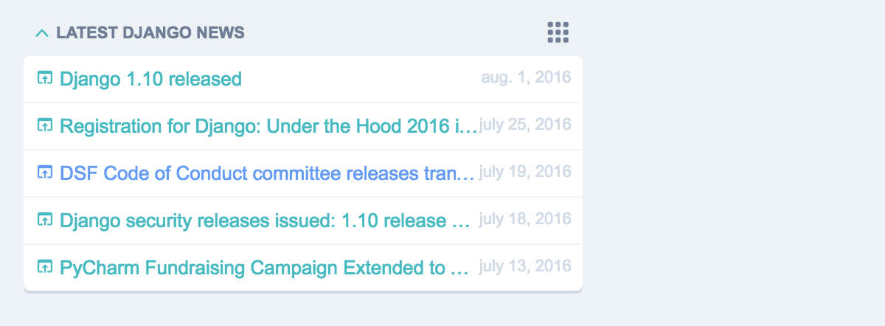
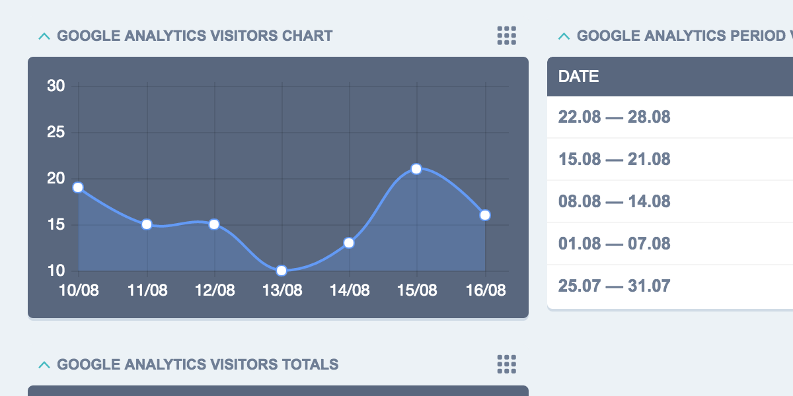
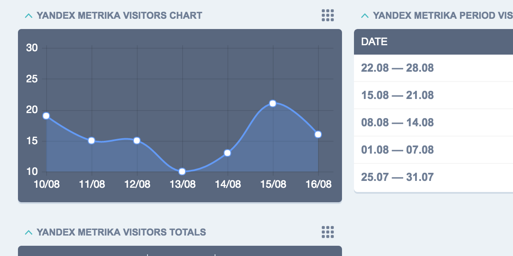

=================
Dashboard Modules
=================

Build-In Dashboard Modules
==========================

LinkList
--------

.. autoclass:: jet.dashboard.modules.LinkList
   :members:

AppList
-------

.. autoclass:: jet.dashboard.modules.AppList
   :members:

ModelList
---------

.. autoclass:: jet.dashboard.modules.ModelList
   :members:

RecentActions
-------------

.. autoclass:: jet.dashboard.modules.RecentActions
   :members:

Feed
----

.. autoclass:: jet.dashboard.modules.Feed
   :members:

Google Analytics Widgets
========================

.. attention::
   Google Analytics widgets required extra setup

Extra Installation
------------------

* Install python package:

.. code::

   pip install google-api-python-client==1.4.1

* Specify path to your Google Analytics ``client_secrets.json`` (obtained at Google website):

.. code::

   JET_MODULE_GOOGLE_ANALYTICS_CLIENT_SECRETS_FILE = os.path.join(PROJECT_DIR, 'client_secrets.json')

* Add import to the top of your urls.py:

.. code::

   from jet.dashboard.dashboard_modules import google_analytics_views

Usage Example
-------------
   .. code-block:: python

     from django.utils.translation import ugettext_lazy as _
     from jet.dashboard.dashboard import Dashboard, AppIndexDashboard
     from jet.dashboard.dashboard_modules import google_analytics

     class CustomIndexDashboard(Dashboard):
         columns = 3

         def init_with_context(self, context):
            self.available_children.append(google_analytics.GoogleAnalyticsVisitorsTotals)
            self.available_children.append(google_analytics.GoogleAnalyticsVisitorsChart)
            self.available_children.append(google_analytics.GoogleAnalyticsPeriodVisitors)

.. autoclass:: jet.dashboard.dashboard_modules.google_analytics.GoogleAnalyticsVisitorsTotals
   :members:

.. autoclass:: jet.dashboard.dashboard_modules.google_analytics.GoogleAnalyticsVisitorsChart
   :members:

.. autoclass:: jet.dashboard.dashboard_modules.google_analytics.GoogleAnalyticsPeriodVisitors
   :members:

Yandex Metrika Widgets
======================

.. attention::
   Yandex Metrika widgets required extra setup

Extra Installation
------------------

* Set your Yandex Metrika CLIENT_ID and CLIENT_SECRET (obtained at Yandex Metrika API website):

.. code::

   JET_MODULE_YANDEX_METRIKA_CLIENT_ID = 'YANDEX_METRIKA_CLIENT_ID'
   JET_MODULE_YANDEX_METRIKA_CLIENT_SECRET = 'YANDEX_METRIKA_CLIENT_SECRET'

* Add import to the top of your urls.py:

.. code::

   from jet.dashboard.dashboard_modules import yandex_metrika_views

Usage Example
-------------
   .. code-block:: python

     from django.utils.translation import ugettext_lazy as _
     from jet.dashboard.dashboard import Dashboard, AppIndexDashboard
     from jet.dashboard.dashboard_modules import yandex_metrika

     class CustomIndexDashboard(Dashboard):
         columns = 3

         def init_with_context(self, context):
            self.available_children.append(yandex_metrika.YandexMetrikaVisitorsTotals)
            self.available_children.append(yandex_metrika.YandexMetrikaVisitorsChart)
            self.available_children.append(yandex_metrika.YandexMetrikaPeriodVisitors)

.. autoclass:: jet.dashboard.dashboard_modules.yandex_metrika.YandexMetrikaVisitorsTotals
   :members:

.. autoclass:: jet.dashboard.dashboard_modules.yandex_metrika.YandexMetrikaVisitorsChart
   :members:

.. autoclass:: jet.dashboard.dashboard_modules.yandex_metrika.YandexMetrikaPeriodVisitors
   :members:
